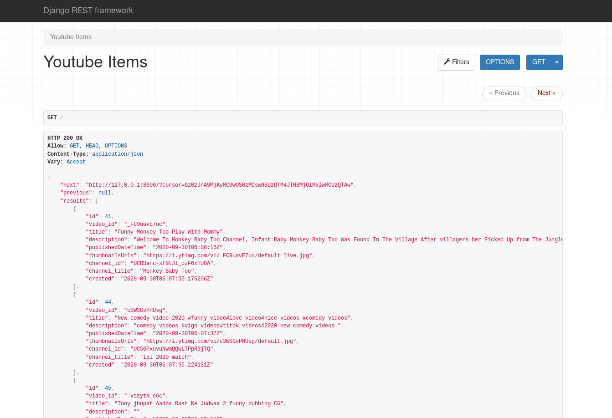
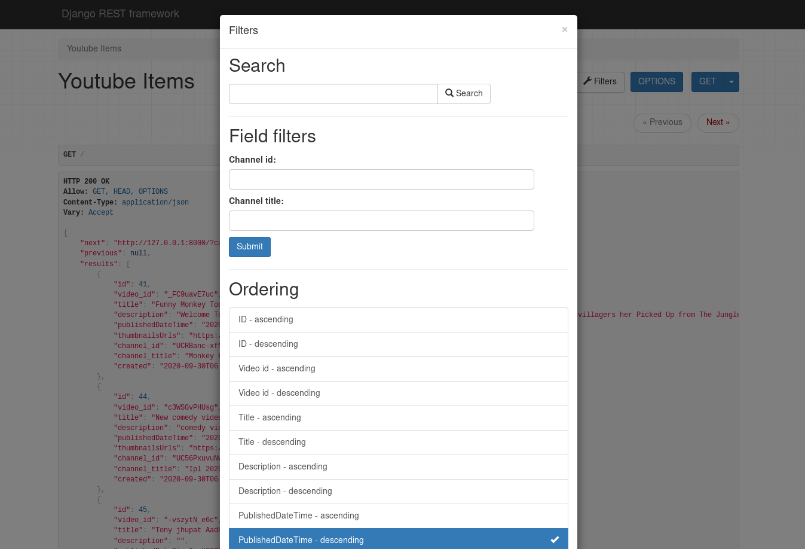

# YoutubeFetchApi
An API to fetch latest videos sorted in reverse chronological order of their publishing date-time from YouTube for a given tag/search query in a paginated response.

API will continuously in background call (async) with interval of 10 min for fetching the latest videos for a predefined search query and will store the data of videos in a database with proper indexes.
## Screenshots

For visualization through a dashboard one may directly run the app locally and the get the UI provided through django-rest-framework.

### Dashboard

### Filters

## Method Used

Used Cron Jobs [django_cron](https://django-cron.readthedocs.io/en/latest/introduction.html) to fetch videos after every 10 minutes using [Youtube Data Api](https://developers.google.com/youtube/v3/docs/search/list) and save it to the db

## Setup Guide
- Clone this repo
- As this project is based on Django, your system need to have proper python setup, refer [this](https://www.python.org/downloads/)
- To install all the requirements type `pip install -r requirements.txt` in the terminal
- Add all the available API keys in `setting.py` variable `GOOGLE_API_KEYS` in this manner`['API_KEY_1','API_KEY_2',...]`
- For getting an API key follow [this](https://developers.google.com/youtube/v3/getting-started)
- Setup crontab to run Job, Follow [this](https://django-cron.readthedocs.io/en/latest/installation.html)
- Run server using `python manage.py runserver`
